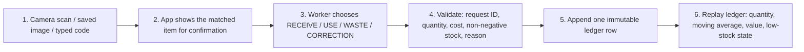

## Build, Break, Recover, Transfer

**Course level:** ADI201 (Steps 0–9). The ADI501 graduate extension does not apply to this team and is marked N/A below.
**Agent:** Claude Code. **Build host:** Vinh's MacBook. **Date of this record:** 2026-09-22.

> **Honesty note.** At the student's request, the agent ran the terminal commands in its own shell while the student reviewed every result. The course asks students to run commands personally, so the deviation is recorded here and in `ai-use-log.md`; the demonstration commands are re-run by the student before the oral defense. Rows that depend on the phone test or on teammates are marked **pending** rather than filled with guesses.

**Where detailed evidence goes:** see `evidence/` — acceptance criteria, decision table, known-answer worksheet, failure log, mobile test, regression test, intern handoff.

---

## Team Roles & Rotation

- **Builder Lead:** Vinh Hoang — Docker build, SQLite ledger, Week 3 restore, the three identification paths.
- **Verifier Lead:** **TBD — teammate B** (MacBook) — independent re-run of the known-answer sequence and the phone transfer test.
- **Business & Decision Lead:** **TBD — teammate C** (Ubuntu) — costing trade-off, intern handoff test, README limitations.

Rotation agreed for the next checkpoint: Vinh → Verifier, B → Business, C → Builder (`team-agreement.md`).

---

# Part 1 — Understand the Mobile Worker Loop

Step 2 is a stopping point, not a formality: identification never writes anything. In our tests the ledger row count stayed at 3 across every lookup.

**Why a QR scan identifies an item but cannot prove quantity or purchase cost:**

The QR holds one short string, `PHO65-INV-000101`, and nothing else. It says *which* item, never *how many* or *at what price*. Those two facts exist only on the delivery and its invoice, so a human has to count the bags and read the price. That is also why our receipt path requires a quantity and a unit cost to be typed and why WASTE and CORRECTION require a written reason: the scan answers "what", and a person has to answer "how much" and "why".

---

# Part 2 — Make the Reference Cost Calculation

- **Event 1:** receive 10 bags @ $2.00 → 10 on hand, average $2.00, value $20.00
- **Event 2:** receive 10 bags @ $2.50 → 20 on hand, average (2000 + 2500) ÷ 20 = 225 cents = **$2.25**, value $45.00
- **Event 3:** use 12 bags → 8 on hand, average still **$2.25**, value 8 × 225 = **$18.00**

Observed in the app with request IDs `r-01`, `r-02`, `r-03`: `8 bag on hand · average $2.25 · value $18.00`, three ledger rows. Hand calculation and app agreed on the first run (`evidence/quantity-cost-known-answer.md`).

**Why a USE event does not change the moving weighted average:**

Using stock removes units that were already bought at the blended cost. Twelve bags leave at $2.25 each, and the eight that remain were bought on exactly the same mix of deliveries, so the cost per remaining bag has not changed — only how many are left. The average moves only when new stock arrives at a different price, because that is the only moment the mix changes.

**Rounding rule:** one rule everywhere — whole cents, `ROUND_HALF_UP`, applied only when a receipt recalculates the average.

---

# Part 3 — Architectural & Workflow Decisions

| Decision | Team choice | Plain-language justification |
|---|---|---|
| **1. Item code / label** | Internal Pho65 QR (`PHO65-INV-######`), marked "internal use only" | One code style across suppliers, and no invented retail identifier. Verified the label's QR encodes exactly the stored code |
| **2. Inventory costing** | Moving weighted average, integer cents | The shared reference rule; smooths price swings; one number a worker can act on. Trade-off recorded in `decision-table.md` Part B |
| **3. Base unit** | One whole base unit per item (bag, carton, each) | Matches how the shelf is counted; case-to-bottle conversion is deliberately deferred |
| **4. Duplicate protection** | Unique `request_id` per submission, enforced by a database UNIQUE constraint | A double tap on a slow phone link cannot create a second row, even if the form is bypassed |
| **5. Negative stock** | Hard block on **every** reducing action (used, wasted, counted, correction) | The starter guarded only used/wasted; we extended it. A refused event writes nothing at all |
| **6. Low-stock alert** | `quantity <= reorder_point` ⇒ LOW; threshold set per item (Rice noodles 8, Oat milk 4) | The rule is printed on the dashboard so written policy and code cannot drift apart. Boundary tested at 3 / 2 / 1 |
| **7. Reason required** | WASTE and CORRECTION need a written reason | An unexplained write-off is how inventory quietly stops matching the shelf |
| **8. Scanner source** | `html5-qrcode` served by our own app, QR format only | Works without internet at demo time; retail barcode formats are not decoded at all |

---

# Part 4 — Local Stack & Mobile Phone Execution

- **Startup:** `docker compose up -d --build` from `docker/` → both services Up (`5000->5000`, `2222->22`)
- **Local dashboard:** `http://localhost:5000/inventory`
- **Health:** `{"inventory_db":"/inventory-data/pho65-inventory.db","orders_csv":"/data/pho65-orders-valid.csv","overdue_min":20,"status":"ok"}`
- **ngrok command (separate terminal, student-owned account):** `ngrok http 5000`
- **ngrok program version installed by the agent:** 3.39.11 — the agent stopped before sign-in. **The account owner personally configured the ngrok authtoken. The token was not recorded.**
- **Mobile device & OS tested:** **pending** (Step 8, teammate B)
- **Desktop phone-width check:** at 375 × 812 the scan page stacks into single-column cards, has no horizontal scrolling, and buttons are at least 44 px tall
- **Security check:** no authtoken, key, or internal address appears in page source, project files, or screenshots. Verified before submission by searching for `authtoken`, `TOKEN`, `ngrok.yml`, and private-key headers

---

# Part 5 — Failure & Recovery Verification

| # | Controlled failure | Observed behaviour (exact) | Safe recovery action |
|:-:|---|---|---|
| **A** | Unknown code `PHO65-INV-999001` | "Unknown code … is not in Pho65 inventory. Nothing was recorded." with safe next steps | Check for a typo, or create the internal item deliberately. No item or row is created automatically |
| **B** | Duplicate request ID (`r-03` reused) | "That button press was already recorded; no duplicate transaction was added." State stayed 8 bags / 3 rows | None needed — the first event stands; the worker checks History |
| **C** | Negative stock: use 100 of 8, and correction −999 | "This would make stock negative. Count what is present or record a correction with an explanation." State unchanged both times | Count the shelf, record a CORRECTION with a reason, then the use |
| **D** | Changing receipt cost ($2.00 then $2.50) | Average reported **$2.25**, not the naive "latest price" $2.50 | None — the failure mode did not occur |
| **E** | Camera denied | Page shows "Camera unavailable (…). Use the saved-image or typed-code path below — both work without the camera." Desktop manual path resolves the same item | Use saved image or typed code. **Phone run pending** (teammate B) |
| **F** | Low-stock boundary (threshold 2) | on hand 3 = OK, 2 = LOW, 1 = LOW; code uses `quantity <= reorder_point`, matching the printed rule | None — written policy and code agree |
| **+** | WASTE with no reason | "A wasted event needs a short written reason before it can be recorded." No row added | Add a reason and resubmit; one row is then recorded |

- **Automated test result:** `docker compose exec app python test_inventory.py` → `inventory known-answer and guard tests passed` (this script prints one line; it does not report a count of tests)
- **Restart persistence:** after `docker compose restart app` — 8 bags, $2.25, $18.00, 3 rows; database present on the mounted volume
- **Week 3 regression:** `/health` ok; `/` shows **3 orders overdue** (threshold 20, reference time 2026-01-15 12:30); `ssh … -p 2222 whoami` → `pho65user` (`evidence/regression-test.md`)

---

# Part 6 — Professional Transfer & Reflection

## Non-Technical Manager Summary

Pho65 staff currently change a number in a spreadsheet, so nobody can tell why stock moved or whether a tap was counted twice. We extended the café's existing system with a phone-friendly inventory helper. A worker identifies an ingredient in one of three ways — camera scan, a saved photo of the label, or typing the code — and the app shows the matched item before anything is recorded. The worker then records a delivery, a use, a waste, or a correction, and each one becomes a permanent line in a ledger showing who recorded it and when.

Costs use a moving weighted average: after receiving ten bags at $2.00 and ten at $2.50, the cost per bag reads $2.25, which we checked by hand before trusting the screen. Safeguards block impossible entries: stock cannot go below zero, a repeated tap cannot record twice, and a waste needs a written reason. A correction never erases history; it is added as a new line.

The Week 3 order tracker and the secure remote-support login still work unchanged. **Limitation:** the average hides the most recent price, and the pilot has no user accounts.

## Value Evidence Comparison

| Measure | Previous clipboard / spreadsheet process | Mobile scanner trial | Measured or estimated? |
|---|---:|---:|---|
| Time to record one stock event | ~2–3 min (write on a sheet, retype into a spreadsheet later) | **pending** — timed during the phone test | Previous: **estimated**; trial: to be **measured** |
| Delay before the number is visible | End of shift, when someone types it up | Immediate — the page recomputes from the ledger | **Measured** (observed in the app) |
| Duplicate entries from a repeated tap | Possible and invisible | 0 — the second submission is refused by the database | **Measured** (Failure B) |
| Cost arithmetic errors | Manual average, redone by hand each delivery | 0 in the known-answer test: hand calculation and app both give 8 / $2.25 / $18.00 | **Measured** |
| Explanation of *why* a number changed | Usually none | Every change carries who, when, and a reason for waste/correction | **Measured** |

Nothing in this table is filled with an invented time saving; the two cells that need a stopwatch are marked pending until teammate B runs the phone test.

## Team Reflection

1. **What did working as a team make possible or faster?** **Pending team answers.** So far the build ran on one machine; the intended gain is that the verifier re-runs the known answer without seeing the builder's numbers, which is a stronger check than the builder testing their own work.
2. **Which design decision required the most debate?** The negative-stock guard. The starter blocked only USE and WASTE, so a "correction" could still push stock below zero. Blocking corrections too means a worker facing an impossible count must stop and count the shelf rather than typing a number that makes the screen look right.
3. **Which failure drill taught the most about real kitchens?** The duplicate-request test. A phone on a weak connection invites a second tap, and the fix that matters is at the database (UNIQUE `request_id`), not a disabled button — a button can be bypassed by a refresh.
4. **What is the most critical human check software cannot automate?** Counting the physical delivery against the invoice. The app cannot see the crate. If someone types 100 bags at $25.00, every guard passes and the average is confidently wrong.

---

# ADI501 Graduate Extension

**N/A — this is an ADI201 team.** `evidence/inventory-control-matrix.md` and `evidence/pilot-and-support-memo.md` are excluded from our submission.

---

# Exit Ticket

1. **One command I can explain in plain language:** `docker compose exec app python test_inventory.py` — runs the packaged test **inside** the already-running app container, against a temporary database, so it proves the cost answer and the guards without touching the pilot ledger.
2. **One accounting principle without jargon:** moving weighted average — when new stock arrives at a different price, add what the old stock cost to what the new stock cost and divide by the new total, so every unit carries one blended cost.
3. **One mobile-specific obstacle diagnosed:** phone browsers only grant camera access on a secure page, so `http://<laptop-ip>:5000` can never work; the HTTPS tunnel is what makes the camera path possible, and saved-image and typed-code paths exist for when it is not.
4. **One safeguard against duplicate transactions:** every submission carries a unique request ID, and the column is UNIQUE in SQLite, so the second write is refused by the database rather than by the form.
5. **One human responsibility that must never be delegated:** checking the physical goods against the invoice before recording a receipt — and keeping the ngrok authtoken and private keys out of any prompt, file, or screenshot.
